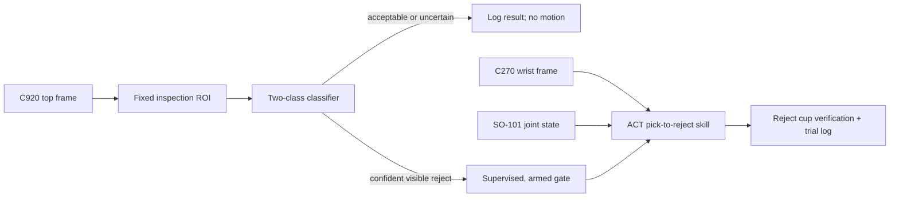

# BeanSight VN

BeanSight VN is a small, supervised robotic workcell for one specific job: finding visibly defective
Vietnamese green-coffee beans and moving them into a reject cup. A fixed Logitech C920 handles
inspection. A wrist-mounted C270 and the SO-101's joint state guide a learned pick-and-place skill.
When the inspection result is acceptable—or uncertain—the arm stays still.

The aim is not to certify food, imitate an industrial sorter, or remove a person from the process. It
is to find out, honestly and quantitatively, how far a low-cost arm can assist a repetitive inspection
step that matters to Vietnam's higher-value coffee processing.

> **Current status, July 16, 2026:** the software contracts, safety gates, camera preflight, dataset
> QA, training configs, evaluation code, and test suite are implemented. The arm has not arrived, so
> this repository does not yet claim a physical success rate. Hardware results will be added only
> after the frozen evaluation is run.
>
> Day-to-day execution is continuing with an AI coding agent (OpenAI Codex). Agent instructions
> live in [AGENTS.md](AGENTS.md); the consolidated status and roadmap of record is
> [docs/HANDOFF.md](docs/HANDOFF.md); task playbooks are in [skills/](skills/README.md).

## What the cell does



The first label set is deliberately narrow:

- `acceptable`
- `visible_reject`: clearly black or broken beans, plus agreed foreign matter

Ambiguous mold, moisture, taste, internal insect damage, and cup quality are outside the claim.

## The evidence standard

The public claim, if the trials support it, will be:

> Built and evaluated a low-cost robotic workcell that identifies and removes visible defects from
> Vietnamese green-coffee samples, measuring agreement with a human grader, grasp reliability,
> cycle time, and failure modes.

Evaluation is split into perception, grasp, placement, and end-to-end outcomes. The frozen v1 run
contains at least 30 reject trials and 20 acceptable-bean no-motion trials. Rates include Wilson 95%
intervals; latency includes median and p95. Every failure receives a fixed code. The complete protocol
is in [docs/evaluation_protocol.md](docs/evaluation_protocol.md).

## Repository map

- `src/beansight_vn/`: typed records, classifier routing, camera soak testing, dataset QA, training,
  trial logging, and summaries
- `configs/`: camera, perception, ACT, optional SmolVLA, rollout, and evaluation contracts
- `patches/`: the pinned LeRobot v0.6.0 macOS encoding workaround
- `docs/`: the maintained hardware, data, execution, evaluation, runbook, handoff, and
  Vietnam-opportunity guides
- `skills/`: portable agent playbooks for hardware bring-up, recording, dataset QA, training,
  evaluation, and reporting
- `tests/`: deterministic tests that do not require the arm or cameras
- `results/`: small hardware-generated summaries and figures; never invented placeholder results

The older research notes and the proven simulation-to-Hugging-Face/Vast.ai pipeline remain in
[RETRO.md](RETRO.md). The wider idea bank is preserved in
[docs/vietnam_applications.md](docs/vietnam_applications.md). They explain the path and alternatives,
but the flagship work is BeanSight VN.

## Install and verify

This project uses Python 3.12 and a separately pinned LeRobot v0.6.0 checkout.

```bash
python3.12 -m venv .venv
source .venv/bin/activate
pip install -e '.[dev,camera]'
pytest
ruff check .
```

Perception training also needs the `perception` extra. Arm recording and policy training should run
inside the pinned LeRobot environment in [docs/runbook.md](docs/runbook.md).

## Arrival-day gate

Do not power either arm until the motor models, controller boards, connectors, voltage, current, and
polarity have been photographed and checked against the invoice. The expected arrangement—only
after that physical check—is 5 V for the leader and 12 V for the follower. The two supplies and arms
must be permanently color-labeled.

After connecting the cameras, run the semantic 30-minute soak:

```bash
beansight-camera-preflight \
  --top-match C920 \
  --wrist-match C270 \
  --duration 1800 \
  --output results/camera_preflight
```

The command resolves model names afresh, opens both cameras together at 640×480/30 MJPG, and writes
sample frames plus `camera_preflight.json`. A failed report cannot generate a recording config.

Once the leader and follower ports are known:

```bash
beansight-build-record-config results/camera_preflight/camera_preflight.json \
  --follower-port /dev/REPLACE_FOLLOWER \
  --leader-port /dev/REPLACE_LEADER \
  --repo-id YOUR_HF_USER/beansight-vn-coffee-v1
```

That produces `configs/generated/record_coffee.json` with stable semantic camera keys. Follow the
commands and physical gates in [docs/runbook.md](docs/runbook.md); do not skip directly to recording.

## Training gates

Before any paid GPU run:

```bash
beansight-dataset-qa YOUR_HF_USER/beansight-vn-coffee-v1 \
  --revision IMMUTABLE_HF_COMMIT \
  --output results/dataset_qa.json
```

QA rejects swapped cameras, missing or unreadable frames, malformed episode metadata, action shape
errors, NaN/Inf, and constant action dimensions. ACT is the required policy. SmolVLA remains optional
and is only attempted after ACT exceeds 40% on 20 frozen trials and the evaluation tooling is complete.

## Safety and scope

The integrated controller is unarmed by default. It consumes the C920 frame already present in the
robot observation; it never competes for a second handle to the same camera. A motion callback must be
provided explicitly before it can arm. Operation is supervised, the switched power strip stays within
reach, and demonstration beans are never returned to food use.

Read [docs/hardware_and_safety.md](docs/hardware_and_safety.md) before assembly or power-up. Coffee
capture and roaster review use [docs/data_and_labeling.md](docs/data_and_labeling.md); the month and
public deliverables are tracked in [docs/execution_and_portfolio.md](docs/execution_and_portfolio.md).

## Why coffee

Vietnam is working to increase the value retained through coffee processing, while post-harvest
sorting remains a measurable loss point and visible green-coffee defects have formal definitions.
The design is informed by the [Vietnam Ministry of Agriculture](https://en.mae.gov.vn/Pages/chi-tiet-tin-Eng.aspx?ItemID=9069),
the [FAO coffee-loss assessment](https://www.fao.org/media/docs/statisticslibraries/apcas/apcas_24_b3-3_result-of-12-3-1a-%28loss-in-coffee%29-%28viet-nam%29-pptx.pdf),
[TCVN 4193 guidance](https://vbpl.vn/TW/Pages/vbpq-toanvan.aspx?ItemID=24863), and
[ISO 10470](https://www.iso.org/standard/40401.html). These sources motivate the problem; the local
roaster's blind labels define the actual two-class experiment.

Apache-2.0 licensed. Dataset and model releases will carry their own cards, immutable revisions, and
limitations.
